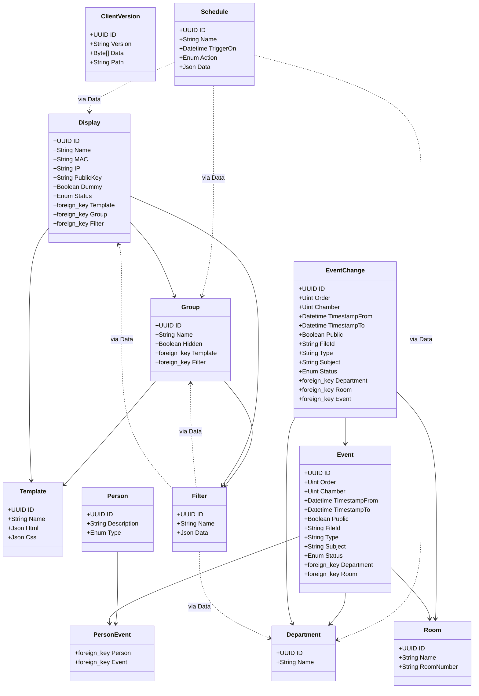

```mermaid
classDiagram
	class Display{
		+UUID ID
		+String Name
		+String MAC
		+String IP
		+String PublicKey
		+Boolean Dummy
		+Enum Status
		+foreign_key Template
		+foreign_key Group
		+foreign_key Filter
	}
	class ClientVersion{
		+UUID ID
		+String Version
		+Byte[] Data
		+String Path
	}
	class Template{
		+UUID ID
		+String Name
        +Json Html
        +Json Css
	}
	class Group{
		+UUID ID
		+String Name
		+Boolean Hidden
		+foreign_key Template
		+foreign_key Filter
	}
	class Filter{
		+UUID ID
		+String Name
		+Json Data
	}
	class Event{
		+UUID ID
		+Uint Order
		+Uint Chamber
		+Datetime TimestampFrom
		+Datetime TimestampTo
		+Boolean Public
		+String FileId
		+String Type
		+String Subject
		+Enum Status
		+foreign_key Department
		+foreign_key Room
	}
	class EventChange{
		+UUID ID
		+Uint Order
		+Uint Chamber
		+Datetime TimestampFrom
		+Datetime TimestampTo
		+Boolean Public
		+String FileId
		+String Type
		+String Subject
		+Enum Status
		+foreign_key Department
		+foreign_key Room
		+foreign_key Event
	}
	class Department{
		+UUID ID
		+String Name
	}
	class Room{
		+UUID ID
		+String Name
		+String RoomNumber
	}
    class Person{
        +UUID ID
        +String Description
        +Enum Type
    }
    class PersonEvent{
        +foreign_key Person
        +foreign_key Event
    }
    class Schedule{
        +UUID ID
        +String Name
        +Datetime TriggerOn
        +Enum Action
        +Json Data
    }

    Group --> Template
    Group --> Filter

    Schedule ..> Group : via Data
	Schedule ..> Display : via Data
	Schedule ..> Department : via Data

	Display --> Group
    Display --> Template
	Display --> Filter

	EventChange --> Event
	Event --> Department
	EventChange --> Department

    Person --> PersonEvent
    Event --> PersonEvent

	EventChange --> Room
    Event --> Room

	Filter ..> Group : via Data
	Filter ..> Display : via Data
	Filter ..> Department : via Data
```