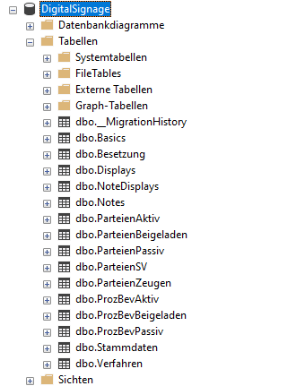
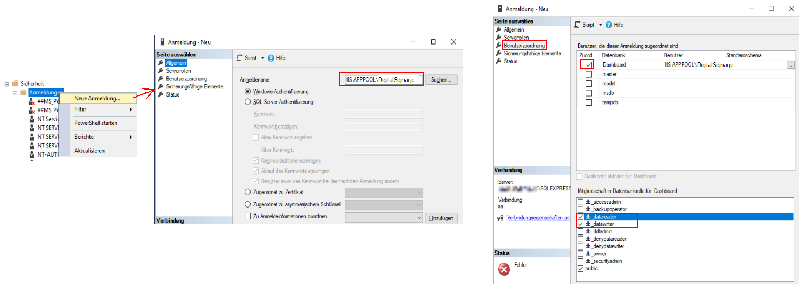
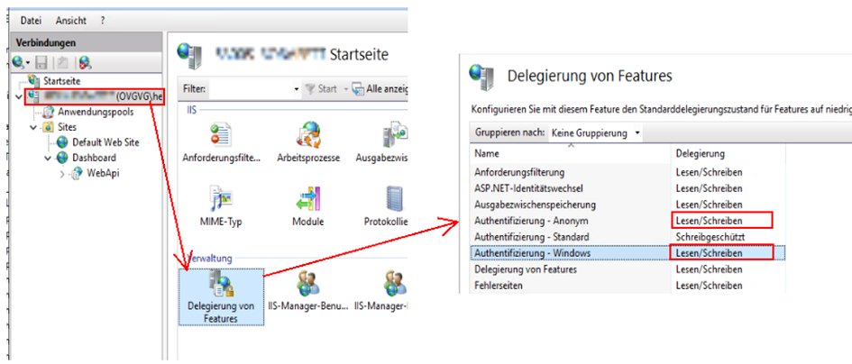
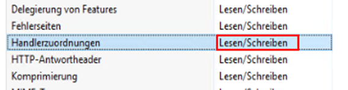
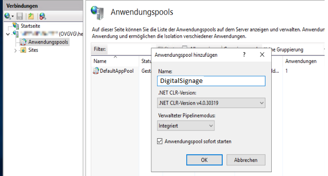
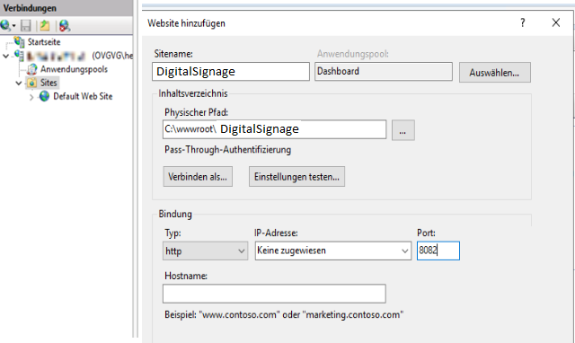
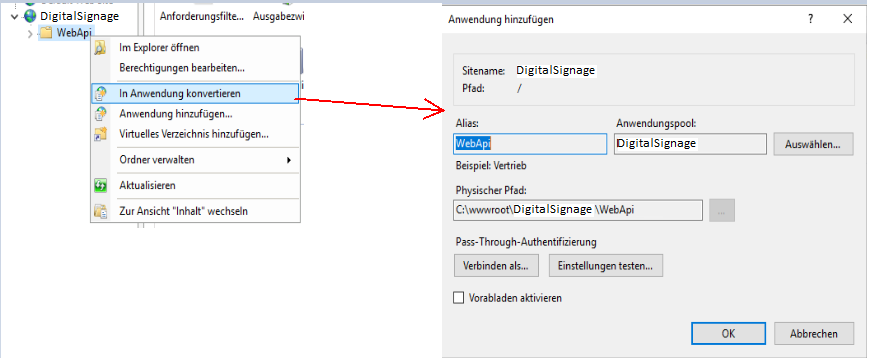
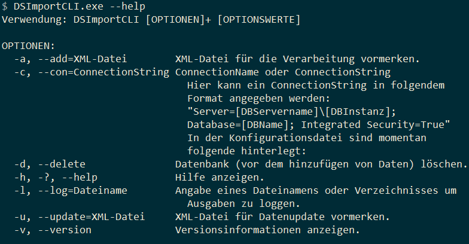

# Allgemeines

Diese Anleitung bezieht sich auf die Installation auf einem Windows-Server System in Verbindung mit einem Hosting auf einem IIS.

# Installation WebApi

Bei dieser Anwendung handelt es sich um eine REST WebApi, das Backend bzw. ein Endpunkt für die verschiedenen DigitalSignage Web-Projekte.

Die WebApi erlaubt Abfragen zu den Stammdaten, persistieren von Stammdaten und noch mehr.

## Allgemeine Vorbereitungen

Dem Windows-Server sollten einige "Rollen und Features" hinzugefügt werden

* Unter Serverrollen
  * Webserver (IIS) -> Webserver -> Anwendungsentwicklung 
    * .NET-Erweiterbarkeit 4.x
    * ASP.NET 4.x

## Vorbereitung der Datenbank

Für die Datenbank ist eine SQL Server Express Instanz ausreichend. 
Im ersten Schritt müssen wir eine neue Datenbank vorbereiten. Dazu 

* legen wir im SQL Server Management Studio eine Neue Datenbank "DigitalSignage" an
* In einer neuen Abfrage führen wir das letzte "full" SQL-Anlageskript aus dem Repository im Unterordner "src\DigitalSignage.Data\Migrations" (bspw. 2-9-0-1904_Full.sql) aus.
* Anschließend ist die Datenbank wie folgt angelegt: <br>
  
* Später (nach Anlage des Anwendungspools - siehe Kapitel "IIS -> Hosting") sollte abschließend der entsprechende Anwendungspool für die Datenbank berechtigt werden.
  

## IIS

### Vorbereitungen

Auf dem Server welcher des IIS muss das dotnet Hostingbundle in der passenden Version installiert sein. [link]([Hostingpaket | Microsoft Learn](https://learn.microsoft.com/de-de/aspnet/core/host-and-deploy/iis/hosting-bundle))

* bevor wir die web.config konfigurieren, müssen wir IIS dahingehend konfigurieren, dass die Authentifizierungs-Einstellungen über die web.config vorgenommen werden dürfen. <br> 
* weiterhin sollten die Handlerzuordnungen auch auf Lesen/Schreiben stehen <br> 
* ### Hosting

Um die WebApi im IIS zu hosten sind exemplarisch folgende Schritte Not
wendig

* Anlage eines neuen Anwendungspool´s <br> 
* Anschließend können wir eine neue Website "Digitalsignage" hinzufügen, dabei kann auch ein Hostname vergeben werden <br> 
* Alternativ zum Hostnamen können wir diese auch über einen bestimmten Port freigeben, dieser muss aber dann in der Firewall freigegeben werden. Wir nehmen hier einmal exemplarisch den Port 8082.
* Direkt in dem Pfad c:\wwwroot\Digitalsignage erzeugen wir einen Unterordner "WebApi", wo wir die Programmdateien inkl. web.config einfügen. Im IIS müssen wir diesen Unterordner als Anwendung konvertieren. <br> 

## Konfiguration der appsettings.json

In der appsettings.json muss die Windows-Authentication aktiviert werden

```json
    <system.webServer>
    	<security>
         <authentication>
            <anonymousAuthentication enabled="false" />
            <windowsAuthentication enabled="true" />
         </authentication>
      </security>
```


In der appsettings.json der WebApi muss im Attribut `ConnectionStrings.EfContext` die Verbindungszeichenfolge zum Datenbankserver hinterlegt sein. Der \ zwischen dem Server und der Datenbank, in der Schreibeweise `Server=Server\\Database` muss mit \\\ escaped sein.

```json
"ConnectionStrings": {
  "EfContext": "Server=Server;Database=Database;User Id=user;Password=Password;TrustServerCertificate=True;"
}
```

### Verhalten der Anwendung

Die Anwendung selbst kann auch über die Datei appsettings.json konfiguriert werden. Es  können folgende Werte dazu angepasst werden:

| Setting          | Beschreibung    |
| ---------------- | --------------- |
| checkPermissions | true oder false |

## Test

Um die Anwendung zu Testen können einfach mal die Displays abgefragt werden:

TODO
http://[Hostname]:[port]/webapi/settings/displays

# Installation Webanwendung Displays

Das gezippte Bild-Artefakt muss in den IIS-Ordner extrahiert werden. Danach die Anwendungansicht im IIS mit Rechtsklick -> Aktualisieren neu laden. Danach einen Rechtsklick auf den neuen Ordner namens "Displays" und "In Anwendung konvertieren" auswählen.

Wichtig ist das die Anwendungsdaten direkt in der nächsten Ebene des Ordners liegen, also index.html, der Asset-Ordner usw.

# Installation Webanwendung RoomControl

Das gezippte Bild-Artefakt muss in den IIS-Ordner extrahiert werden. Danach die Anwendungansicht im IIS mit Rechtsklick -> Aktualisieren neu laden. Danach einen Rechtsklick auf den neuen Ordner namens "Displays" und "In Anwendung konvertieren" auswählen.

Wichtig ist das die Anwendungsdaten direkt in der nächsten Ebene des Ordners liegen, also index.html, der Asset-Ordner usw.

# Installation Webanwendung DS-Manager

Das gezippte Bild-Artefakt muss in den IIS-Ordner extrahiert werden. Danach die Anwendungansicht im IIS mit Rechtsklick -> Aktualisieren neu laden. Danach einen Rechtsklick auf den neuen Ordner namens "Displays" und "In Anwendung konvertieren" auswählen.

Wichtig ist das die Anwendungsdaten direkt in der nächsten Ebene des Ordners liegen, also index.html, der Asset-Ordner usw.

# ImportCLI

Diese Anwendung wird als Task gestartet. Die Konfigurationsparameter werden über die CLI eingespeist. Wie in diesem Beispiel ersichtlich:

` DSImportCLI.exe -a TO.xml -c "Server=(localdb)\MSSQLlocalDB;Database=testdatenbank;Integrated Security=true;" -d`

  


# Display Control 
Installation eines zusätzlichen Monitors in der digitalen Saalanzeige

* Gerät anschließen und hochfahren
* 1_SetupNetwork.ps1 als Administrator ausführen
* Parameter wie IP, Gerätename etc. eingeben (Achtung: Hier muss zwei mal die Zugangsdaten von ovgvg\admin eingegeben werden!)
* Gerät neu starten als admin
* 2_Update.ps1 ausführen
* Parameter wie Saalanzeigenbenutzer etc. eingeben
* Gerät startet als Saalanzeigenbenutzer neu
* 3_User.ps1 als Benutzer ohne Adminrechte ausführen
* Fertig!

Bei Schritt 2 kann es zu einem Fehler beim Beitreten der Domäne kommen. Sollte dies passieren, kann Schritt 4 nicht erfolgen.
In dem Fall muss erneut mit dem lokalen Admin ein Beitritt in die Domäne Manuell durchgeführt werden.
