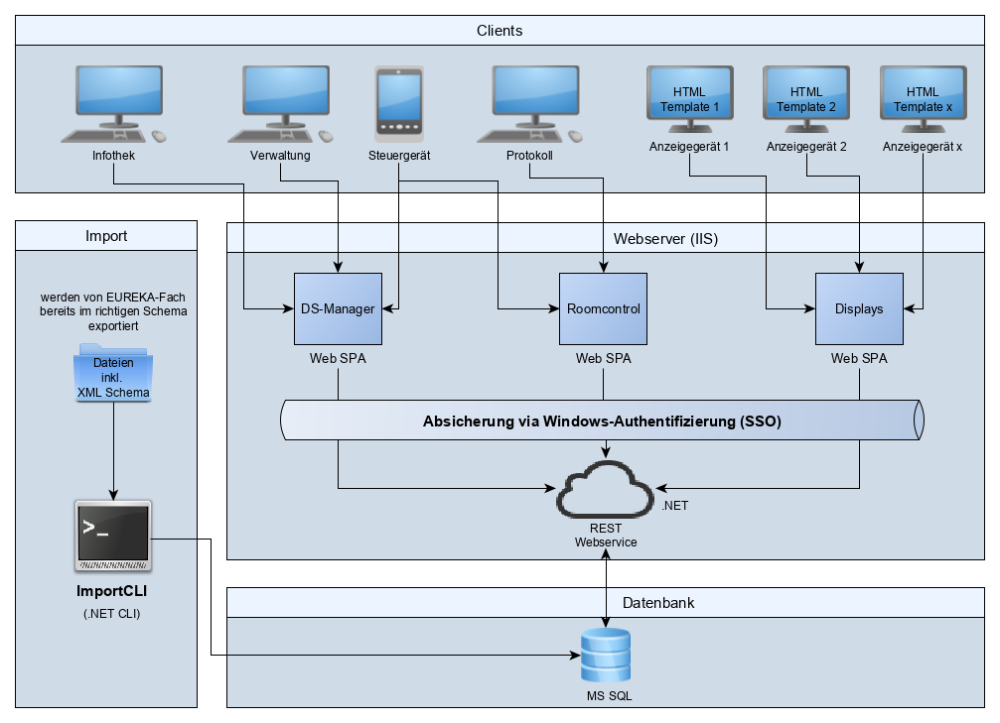
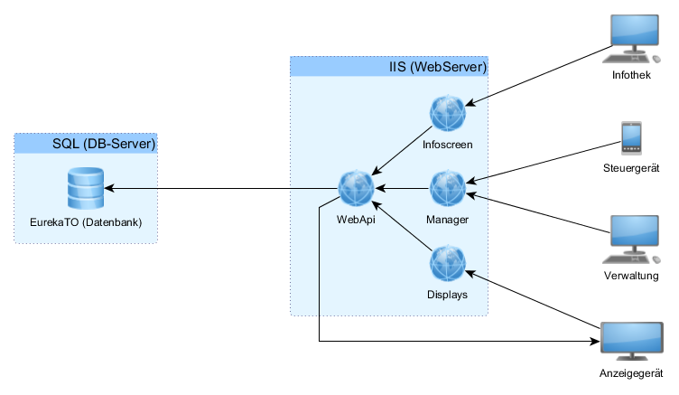
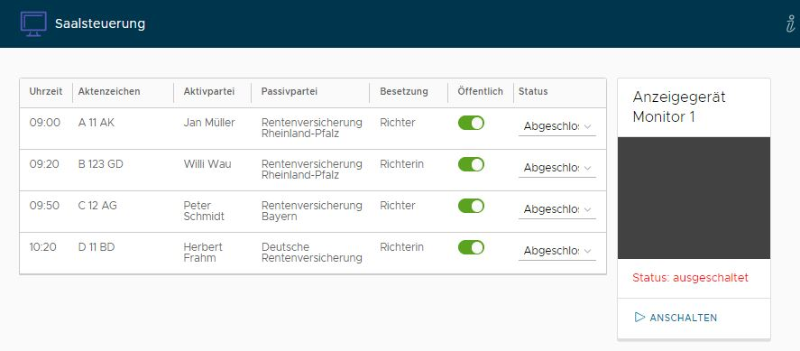

# OVGRLP-digitalsignage

Eine digitales Gerichtssaalanzeigen-System zur Bestückung von Gerichtssälen und Warteräumen mit Monitoren zur Anzeige von Terminen und Sonderanzeigen.  

# Beschreibung

Mit der Software lassen sich mehrere Anzeigen an verschiedenen Standorten betreiben. Mögliche Orte zur Präsentation sind Wartebereiche, dort wird eine Übersicht aller Verhandlungen am entsprechenden Tag angezeigt. Sowie vor jedem Gerichtssaal, dort wird auch angezeigt ob gerade eine Verhandlung läuft oder schon beendet ist. Dies wird aus dem Gerichtssaal heraus gesteuert. 

Zur Administration gibt es eine Übersicht über alle Displays von dort können diesebei Bedarf auch neu gestartet werden. 

Ferner auch Sondermeldungen angezeigt werden, diese werden dann zeitlich und räumlich zugeordnet um die eigentliche Anzeige ganz oder teilweise zu überblenden.

Die täglichen Termine werden automatisch aus Eureka-Fach exportiert.

## Architektur

Darstellung der verschiedenen Systeme des Systems anhand deren Geschäftsfunktion.

Technische Sicht des Systems.

## Einzelne Software Komponenten

Display Control - Monitor-Anwendung

Anwendung welche auf jedem einzelnen Monitor installiert ist zwecks Kontrolle

ImportCLI - Server Job

Anwendung welche die Termine aus Eureka in die Datenbank importiert

WebApi - Webserver Anwendung

Zentraler Webservice zur Übertragung aller Termine, Sondermeldung und weiterer Daten an die Anzeigen.

Displays - Browser App

Übersicht der Anzeigen mit möglicher Darstellung in Vollbild. Diese Anwendung wird auch auf jedem Monitor dargestellt.

DSManager - Browser App

Verwaltung der Zustände der Anzeigen in Gruppen gegliedert. Filterbare Übersicht über alle täglichen Verhandlungen. Management zur Auflistung, Erstellung, Bearbeitung, Löschung und Terminierung der Sonderanzeigen. Mit HTML-Editor und Vorschaufunktion.

RoomControl (Saalsteuerung) - Browser App

Hier können Sitzung gestartet, beendet und als Nicht-öffentlich markiert werden. Monitor können an- sowie ausgeschaltet werden. Es wird eine Vorschau der ausgewählten Anzeige dargestellt.

## Installation

Eine entsprechende Installationsanleitung findet sich [hier](Documentation/installation.png)

## Konfiguration

Die folgenden Konfigurationsdateien müssen mit Ihren eigenen Daten erstellt werden und sind daher nicht Teil der Quellcodeverwaltung. 

* DisplayControl: `App.config`
* Import:CLI: `App.config`
* WebApi: `Web.config`
* displays: `src/assets/config.json`
* DSManager: `src/assets/config.json`
* RoomControl: `src/assets/config.json`

# Dev

Die SPA kann fürs debugging gestart werden durch 

1. Start der Digital.Signage.WebApi über Visual Studio
2. C:\dev\repos\digitalsignage\src\ds-suite> npm run serve:displays
3. C:\dev\repos\digitalsignage\src\ds-suite> npm run serve:dsmanager

sowie eintragen der richtigen ports in den configs

1. apps > displays > src > assets > config.json > webApiUrl : "webApiUrl": "http://localhost:52208/",
2. apps > dsmanager > src > assets > config.json > webApiUrl : "webApiUrl": "http://localhost:52208/",

NuGet-Quelle Hinzufügen
Unter Optionen > NuGet-Paketmanager > Paketquellen folgende Quelle Hinzufügen
\\Ovgvg\it\OVGRLP\Dev\NugetFeed\

# Kontakt

Oberverwaltungsgericht Rheinland-Pfalz, Deinhardpassage 1, 56068 Koblenz 
poststelle(at)ovg.jm.rlp.de

# Lizenz

Copyright © 2014-present Oberverwaltungsgericht Rheinland-Pfalz 
Lizenziert unter der EUPL, version 1.2 oder höher
Für weitere Details siehe Lizenz.txt oder EUPL-1.2 EN.txt
oder online unter https://joinup.ec.europa.eu/collection/eupl/eupl-text-eupl-12
